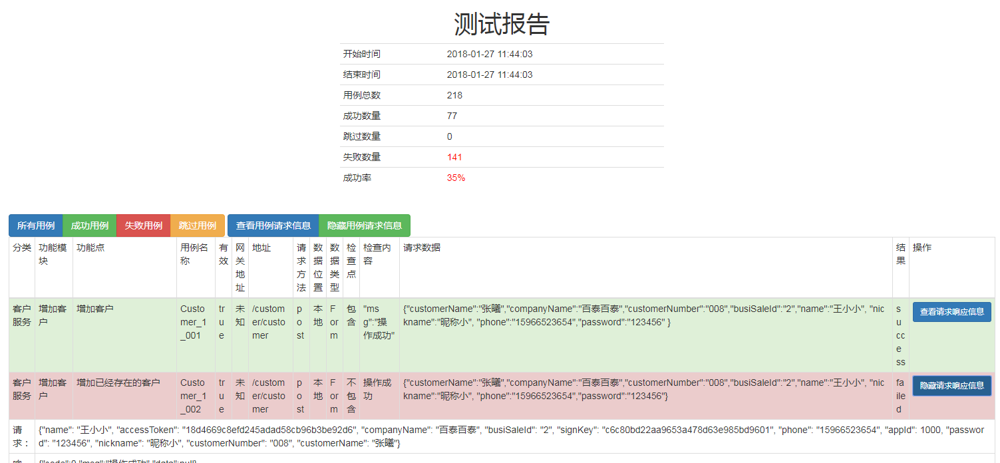

# 接口自动化测试
* 语言:python http请求模块: requests
* 支持请求参数加密(已实现md5加密)，util中的get_sign_key
* xml管理测试用例(test_case.xsd定义测试用例的结构)
* 支持本地报告和邮件发送报告，测试报告可查看请求和响应信息，支持测试用例过滤
* 支持debug模式(用于编写测试用例实时看报告)
* 支持多用户测试，用于测试不同权限

<pre><code>
email:
  host: smtp.qq.com 
  user: 45@qq.com  # 发送帐号
  passwd: uqucfxajhaewbiei  # 密码
  receivers: #邮件接收列表
    - tresyt@qq.com

base:
  debug: 1  # debug模式
  base_url: http://192.168.16.16:8082 # 请求基地址
  username: system_saler  # 基本测试用户
  password: batarbatar3  # 基本测试用户密码
  company_id: 1
  login_url: account/account/login # 登录地址，需要登录
  app_id: 1000  
  app_secret: abc
  case_type: xml  # 测试用例类型
  local_report: 1  # 本地报告
  #上述未注释的为系统使用的全局半数，可针对系统增减
</code></pre>

## 报告样例
